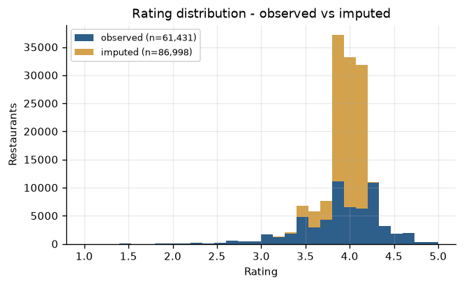
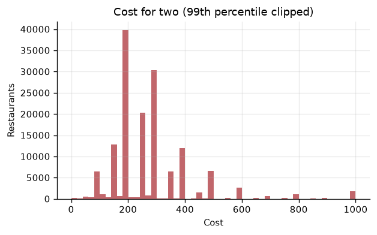
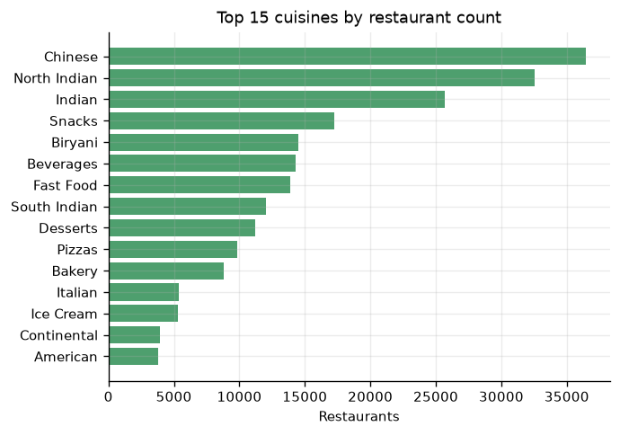
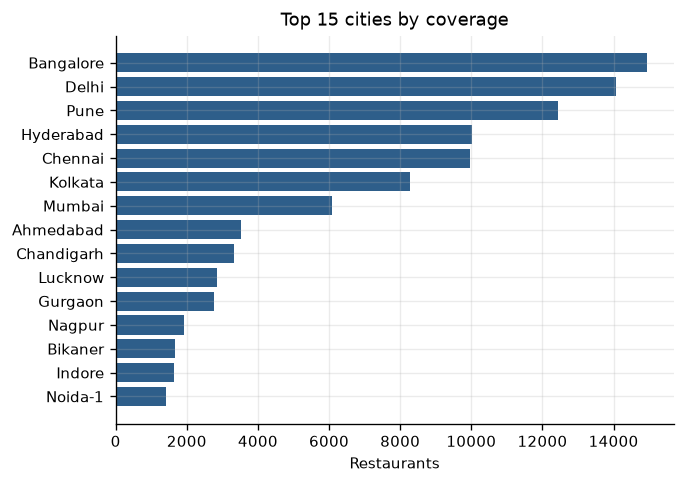
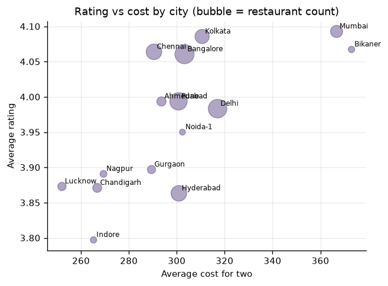
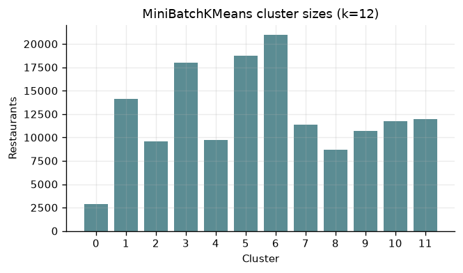

# Swiggy's Restaurant Recommendation System using Streamlit

A preference-driven restaurant recommender: clean the catalogue, one-hot encode
the categorical features, and rank restaurants with cosine similarity or KMeans
clustering — all exposed through a four-page Streamlit application.

---

## 1. Project Overview & Architecture

### Problem statement

Given a user's city, cuisine preferences, budget and minimum acceptable rating,
recommend the restaurants that best match. Recommendations are computed on an
encoded numeric matrix, then mapped back to the human-readable catalogue.

### Approach — mapped to the requirement document

| Required step | Implementation |
|---|---|
| Duplicate removal | `drop_duplicates(subset=["name", "city", "address"])` — 38 dropped |
| Handling missing values | `rating` → city median (flagged); `cost` → city median then global; `rating_count` → floored at 1; rows missing `name`/`city`/`cuisine` are dropped (no signal) |
| Text-to-numeric parsing | `rating` `"--"` → NaN; `rating_count` `"1K+ ratings"` → 1000, `"Too Few Ratings"` → NaN; `cost` `"₹ 200"` → 200.0 |
| Save cleaned data | `data/cleaned_data.csv` |
| One-Hot Encoding of `city`, `cuisine` | `OneHotEncoder` for `city`; `MultiLabelBinarizer` for the comma-separated `cuisine` field |
| Save the encoder | `artifacts/encoder.pkl` (bundle: both encoders + column order) |
| All features numerical | `StandardScaler` on `rating`, `rating_count`, `cost`, saved as `artifacts/scaler.pkl` |
| Preprocessed dataset | `data/encoded_data.csv` |
| **Indices must match** | Asserted at runtime: `len` equality *and* elementwise index equality between `cleaned_data.csv` and `encoded_data.csv` |
| Clustering / similarity | `MiniBatchKMeans` (k=12) **and** `cosine_similarity`, user-selectable in the UI |
| Result mapping | Recommendation indices are resolved with `cleaned.loc[chosen]` |

### Dataset

`data/swiggy.csv` — 148,541 rows, 45 MB, committed to the repo.

| Property | Value |
|---|---|
| Rows in / out | 148,541 → 148,429 |
| Distinct `city` strings | 821 |
| Distinct cities after normalisation | 552 |
| Distinct cuisine tags | 126 |
| Encoded matrix | 148,429 × 681 (3 numeric + 552 city + 126 cuisine) |
| Encoded density | 0.84% (850,203 non-zeros) |

Largest cities by coverage: Bangalore 14,943 · Delhi 14,071 · Pune 12,432 ·
Hyderabad 10,011 · Chennai 9,953 · Kolkata 8,279 · Mumbai 6,070.

Most common cuisines: Chinese 36,461 · North Indian 32,534 · Indian 25,715 ·
Snacks 17,231 · Biryani 14,521.

### Three data-quality decisions worth knowing about

**1. 58.6% of ratings are not real.** 86,998 rows carry `"--"` or
`"Too Few Ratings"`. Imputing them silently would fabricate credibility for
unrated venues, so each imputed row is flagged in two boolean columns,
`rating_imputed` and `is_unrated`. The UI shows an asterisk next to imputed
ratings, and **"Exclude unrated venues" is on by default** in the
recommendation form.

**2. `city` mixes locality and city.** The column holds values like
`"Vastrapur,Ahmedabad"` and `"GOTA,Ahmedabad"` alongside plain `"Abohar"`.
Encoding those raw would put two Ahmedabad neighbourhoods in orthogonal
dimensions, so a user in Ahmedabad would never see cross-locality matches.
The trailing city is extracted into `base_city` and *that* is one-hot encoded
(821 → 552 dimensions). The raw string is preserved in `cleaned_data.csv` and
shown in the UI.

**3. The encoded matrix is sparse, and stays sparse.** 148,429 × 681 dense
float64 is ~800 MB. Everything downstream — KMeans, cosine similarity, the
Streamlit app — uses a `scipy.sparse` CSR matrix persisted as
`data/encoded_data.npz` (1.0 MB). The dense `encoded_data.csv` deliverable is
still written (205 MB, in 10k-row chunks to bound memory) but can be skipped
with `SWIGGY_WRITE_ENCODED_CSV=0` when iterating.

### Why `cuisine` uses multi-hot rather than plain one-hot

The `cuisine` column holds comma-separated lists (`"Biryani, North Indian"`).
Plain one-hot would treat that whole string as one category, so a restaurant
tagged `"Biryani"` would score zero against `"Biryani, Desserts"`. A
`MultiLabelBinarizer` produces one binary column per cuisine tag — the same
one-hot representation the specification asks for, correctly applied to a
multi-label field.

### Architecture

```
data/swiggy.csv                              148,541 rows / 45 MB
  id, name, city, rating, rating_count, cost, cuisine,
  lic_no, link, address, menu
        │
        ▼  clean_dataset()
 parse "₹ 200" / "1K+ ratings" / "--" → de-duplicate → impute (flagged)
 → normalise "Locality,City" → "City"
        │
        ├──▶ data/cleaned_data.csv  ◀── recommendations map back here
        ├──▶ MySQL :3306 / SQLite  (table: restaurants, 148,429 rows)
        │
        ▼  encode_dataset()
 OneHotEncoder(base_city) + MultiLabelBinarizer(cuisine)
 + StandardScaler(numerics)          →  sparse CSR, 148,429 × 681
        │
        ├──▶ artifacts/encoder.pkl, artifacts/scaler.pkl
        ├──▶ data/encoded_data.npz   (1.0 MB — loaded at runtime)
        └──▶ data/encoded_data.csv   (205 MB dense — spec deliverable)
                    │
        ┌───────────┴────────────┐
        ▼                        ▼
 cosine_similarity      MiniBatchKMeans (k=12)
        │                        │  artifacts/kmeans.pkl
        └───────────┬────────────┘
                    ▼
                 app.py  (Streamlit, 4 pages)
```

### Streamlit pages

| Page | What it does |
|---|---|
| Find Restaurants | Preference form → ranked recommendation cards, price/rating scatter |
| Explore Data | Filter and search the full cleaned catalogue |
| Cuisine & City Insights | Cuisine coverage, city cost comparison, positioning scatter, rating histograms |
| Cluster Explorer | KMeans clusters in price/rating space with per-cluster profiles |

### Database schema

```sql
restaurants (
  row_index    INTEGER PRIMARY KEY,   -- matches cleaned_data.csv row order
  id           VARCHAR(30),
  name         VARCHAR(255),
  city         VARCHAR(80),
  rating       DOUBLE,
  rating_count INT,
  cost         DOUBLE,
  cuisine      VARCHAR(255),
  lic_no       VARCHAR(60),
  link         TEXT,
  address      TEXT,
  menu         TEXT
);
```

---

## 2. How to Execute the Project

### Prerequisites

* Python 3.10 – 3.14
* MySQL 8.x (**optional** — SQLite fallback is automatic)

### Step-by-step

```bash
# 1. Clone and enter the project
git clone https://github.com/prawin0309/swiggy-Restaurant-Recommendation-System-using-Streamlit.git
cd swiggy-Restaurant-Recommendation-System-using-Streamlit

# 2. Create and activate a virtual environment
python -m venv .venv
.venv\Scripts\Activate.ps1        # Windows PowerShell
source .venv/bin/activate         # macOS / Linux

# 3. Install dependencies
pip install -r requirements.txt

# 4. Clean → encode → save encoder.pkl → load to SQL
python data_pipeline.py

# 5. Fit KMeans and run the recommendation smoke test
python models.py

# 6. Launch the application
streamlit run app.py
```

Expected output from step 4:

```
[data] using real dataset: swiggy.csv
[clean] 148541 -> 148429 rows | 38 duplicates dropped
[clean] imputed: rating=86,998 (58.6%), rating_count=86,998, cost=44
        -- flagged in the `rating_imputed` / `is_unrated` columns
[clean] 821 raw city strings -> 552 normalised cities
[data] cleaned dataset -> cleaned_data.csv
[save] encoder.pkl
[save] scaler.pkl
[encode] encoded matrix shape = (148429, 681) (552 city columns,
         126 cuisine columns, 850,203 non-zeros, 0.84% dense)
[data] sparse encoded matrix -> encoded_data.npz (1.0 MB)
[data] dense encoded dataset -> encoded_data.csv (205.3 MB)
[verify] index alignment confirmed for 148429 rows
[verify] restaurants row count = 148429
Pipeline completed successfully.
```

> Step 4 takes ~3 minutes, most of it writing the 205 MB dense CSV. Set
> `SWIGGY_WRITE_ENCODED_CSV=0` to skip that file while iterating.

Step 5 prints side-by-side recommendations from both methodologies for a
Bangalore / Biryani / ₹400 preference vector.

---

## 3. Test Credentials & System Configurations

This is a public recommender with **no login wall** — an evaluator can open it
and get recommendations immediately. Credentials below cover the database layer.

### Database configuration

| Setting | Default | Environment variable |
|---|---|---|
| Host | `localhost` | `SWIGGY_DB_HOST` |
| Port | `3306` | `SWIGGY_DB_PORT` |
| User | `root` | `SWIGGY_DB_USER` |
| Password | `root` | `SWIGGY_DB_PASSWORD` |
| Database | `guvi_db` | `SWIGGY_DB_NAME` |
| Backend | `auto` (`mysql` \| `sqlite`) | `SWIGGY_DB_BACKEND` |

`guvi_db` is created automatically when missing.

```bash
export SWIGGY_DB_BACKEND=mysql SWIGGY_DB_USER=root SWIGGY_DB_PASSWORD=your_password
python data_pipeline.py
```

### Application configuration

| Setting | Default | Constant / env var |
|---|---|---|
| Streamlit URL | `http://localhost:8501` | — |
| Dataset | `data/swiggy.csv` (148,541 rows) | `RAW_CSV` |
| Recommendations returned | `10` | `TOP_K` |
| KMeans clusters | `12` | `N_CLUSTERS` |
| Write dense encoded CSV | on | `SWIGGY_WRITE_ENCODED_CSV` |
| Random seed | `42` | `RANDOM_SEED` |

### Ready-made test input

On the **Find Restaurants** page:

| Field | Value |
|---|---|
| City | `Bangalore` |
| Cuisines | `Biryani`, `North Indian` |
| Minimum rating | `4.0` |
| Budget for two | `₹400` |
| Method | `Cosine Similarity` (then re-run with `KMeans Clustering` to compare) |

---

## 4. Results

| Metric | Value |
|---|---|
| Restaurants after cleaning | 148,429 |
| Duplicates removed | 38 |
| Cities (normalised) | 552 |
| Cuisine tags | 126 |
| Encoded matrix | 148,429 × 681, 0.84% dense |
| Index alignment | verified row-for-row |
| MiniBatchKMeans | k=12, silhouette **0.079** (5,000-row sample) |

Sample output for **Bangalore / Biryani + North Indian / ₹400 / rating ≥ 4.2**:

| Restaurant | City | Cuisine | Rating | Cost | Similarity |
|---|---|---|---|---|---|
| Craft of Biryani | Koramangala, Bangalore | North Indian, Biryani | 4.2 | ₹500 | 0.998 |
| Cravisthan | Indiranagar, Bangalore | North Indian, Biryani | 4.2 | ₹300 | 0.998 |
| Masala Pantry | BTM, Bangalore | North Indian, Biryani | 4.2 | ₹300 | 0.998 |
| BOX8 – Desi Meals | CV Raman Nagar, Bangalore | North Indian, Biryani | 4.2 | ₹250 | 0.995 |
| Calcutta Biryani Club | Marathahalli, Bangalore | Biryani, North Indian | 4.2 | ₹300 | 0.991 |

### A note on the clustering score

Silhouette **0.079** is low. That is expected: the feature space is 99.2%
zeros (a restaurant occupies 1 of 552 city dimensions and 1–3 of 126 cuisine
dimensions), and one-hot geometry does not produce well-separated Euclidean
blobs. The clusters are useful as browsing segments, and the **recommendation
quality comes from cosine similarity**, which scores 0.99+ on genuinely
matching restaurants. The KMeans mode is offered as a faster alternative that
restricts the candidate pool before ranking — on the sample above, both
methods return the same top three.

## 5. Tech Stack

Python · Pandas · NumPy · scikit-learn (OneHotEncoder, MultiLabelBinarizer,
StandardScaler, KMeans, cosine similarity) · Streamlit · Plotly ·
mysql-connector-python · SQLite

> **Note:** SQLAlchemy is intentionally not used. Database access is
> cursor-based through `mysql-connector-python` (or `sqlite3` for the
> portable fallback).

<!-- FIGURES:START -->

## Visualizations

Generated by `make_figures.py` from the cleaned dataset and saved artifacts. Re-run it after the pipeline to refresh every image:

```bash
python make_figures.py
```

### Rating distribution



Rating distribution split by observed vs imputed. 58.6% of ratings were missing and are flagged by the rating_imputed column.

### Cost distribution



Cost for two, clipped at the 99th percentile.

### Top cuisines



Top 15 cuisines by restaurant count.

### Top cities



Top 15 cities by coverage.

### Rating vs cost by city



Average rating vs average cost for the largest cities.

### Cluster sizes



MiniBatchKMeans cluster sizes at k=12.

<!-- FIGURES:END -->
